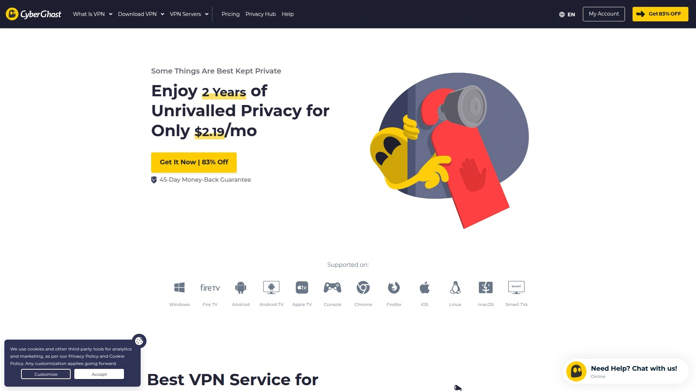

# 2025年十六大最佳VPN工具

在网络审查日益严格、隐私泄露风险持续上升的今天,选择一款可靠的VPN服务已成为保护个人数据和突破地理限制的刚需。无论是远程办公需要安全加密通道、海外留学访问国内资源、还是观看全球流媒体内容,高质量的VPN都能提供军用级加密、隐藏真实IP地址、绕过ISP限速等核心功能。本文精选16款在2025年表现突出的VPN服务,涵盖速度优化、隐私保护、流媒体解锁和P2P支持等多个维度,帮助您根据实际场景快速找到最适合的网络安全工具。

---

## **[PrivateVPN](https://privatevpn.com)**

瑞典军用级加密的流媒体专用VPN服务

PrivateVPN采用2048位加密结合AES-256标准,提供目前市场最高级别的数据保护。该服务在63个国家部署超过200台服务器,虽然数量不及大型提供商,但通过动态专用IP技术有效避免拥堵并提升解锁成功率。平台内置IPv6泄漏保护和自动断线保护开关,即使VPN意外断开也能立即切断网络防止数据泄露。PrivateVPN特别适合流媒体用户,测试显示可稳定访问Netflix、Disney+、Amazon Prime Video、BBC iPlayer和Hulu等主流平台。

**技术特色:** 支持OpenVPN、PPTP、L2TP、IKEv2和IPSec多种协议,Stealth VPN模式可伪装流量为HTTPS绕过深度包检测,使其成为少数能在中国等高审查地区使用的VPN之一。端口转发功能优化P2P下载速度,共享静态IP服务器减少登录异常验证。应用程序提供简易模式和高级模式双界面,新手可一键连接,专业用户能自定义加密强度和协议选择。价格极具竞争力,三年套餐低至每月2美元,包含30天无条件退款保证和14天免费试用。客户支持直接对接开发团队而非外包客服,响应速度和技术深度明显优于行业平均水平。

***

## **[NordVPN](https://nordvpn.com)**

全球最大服务器网络的行业标杆级VPN

NordVPN在118个国家运营超过7700台服务器,是三大主流VPN中网络覆盖最广的提供商。自研NordLynx协议基于WireGuard优化,速度测试中保持84%原始带宽,在美国、英国、德国等主要节点均可达到400Mbps以上的下载速度。平台集成威胁防护功能自动拦截恶意软件和广告追踪器,CyberSec技术额外提供钓鱼网站防护。NordVPN支持同时连接10台设备,适合家庭用户或多设备办公场景。

独特功能包括双重VPN(流量经过两台服务器加密)、Onion Over VPN(结合Tor网络增强匿名性)和混淆服务器(隐藏VPN使用痕迹)。严格的无日志政策已通过普华永道两次独立审计验证。基础套餐未包含NordPass密码管理器,但高级方案可享完整安全工具生态。价格中等,长期订阅性价比突出,提供30天退款窗口和24/7实时客服。

---

## **[ExpressVPN](https://www.expressvpn.com)**

速度与隐私并重的高端VPN解决方案

ExpressVPN覆盖105个国家但未公开服务器总数,采用自研Lightway协议在保持87%速度留存率的同时降低电池消耗。所有服务器运行在RAM-only模式下,重启后自动清除所有数据,从物理层面杜绝日志记录风险。总部位于英属维尔京群岛,不受五眼/九眼/十四眼情报联盟管辖。平台集成Keys密码管理器,所有套餐均包含此功能无需额外付费。

ExpressVPN提供定制版路由器和路由器专用应用,简化全家设备统一保护流程。MediaStreamer智能DNS功能允许游戏机和智能电视等不支持VPN的设备访问地理限制内容。分割隧道功能精细控制哪些应用走VPN通道,哪些直连网络。价格定位高端市场,月费高于竞品但设备兼容性和技术支持质量行业领先。提供30天退款保证,客服响应速度和问题解决能力获广泛认可。

***

## **[Surfshark](https://surfshark.com)**

无设备数量限制的高性价比选择

Surfshark最大亮点是支持无限设备同时连接,一个账户可保护整个家庭或小型团队的所有设备。在100个国家部署约3200台服务器,采用WireGuard协议实现84%速度保持率。CleanWeb功能阻止广告、追踪器和恶意网站,Whitelister分割隧道允许特定应用绕过VPN。

平台提供MultiHop双重VPN连接、伪装模式(Camouflage Mode)隐藏VPN使用、NoBorders模式在受限网络自动切换最佳服务器。GPS欺骗功能(仅Android)修改设备地理位置信息匹配VPN节点。价格是三大主流VPN中最低的,长期套餐性价比极高。内置Cookie弹窗拦截器和数据泄漏警报系统提升日常浏览体验。总部位于荷兰,严格遵守GDPR数据保护法规。与NordVPN于2022年合并但保持独立运营。

***

## **[CyberGhost](https://www.cyberghostvpn.com)**

新手友好的一键式流媒体优化VPN

CyberGhost拥有3800万全球用户,在Trustpilot获得4.2分评价。平台按使用场景预设服务器组(如"For Streaming Netflix US"或"For Torrenting"),用户无需手动测试直接选择优化节点。界面设计极简,连接流程不超过三次点击,特别适合技术基础薄弱的用户。

服务器分布在90多个国家,支持7台设备同时在线。自动广告拦截和恶意网站过滤内置于客户端,无需额外配置。提供45天退款保证,是主流VPN中退款窗口最长的服务商。专用IP地址可选购,避免共享IP导致的验证码频繁出现问题。总部位于罗马尼亚,司法管辖区对隐私保护友好。45天Cookie追踪周期和透明的转化监测系统方便用户评估服务价值。

***

## **[ProtonVPN](https://protonvpn.com)**

开源透明的瑞士隐私保护专家

ProtonVPN由Proton Mail团队开发,服务超过1亿用户,代码完全开源接受公众审计。总部位于瑞士,受世界上最严格的隐私法保护,不受欧盟数据保留指令约束。Secure Core架构将流量通过多个隐私友好国家的服务器中转,即使VPN服务器被攻破也无法追溯真实IP。

NetShield功能拦截广告和恶意软件,VPN加速器(VPN Accelerator)技术在长距离连接中提升速度达400%。免费版本提供无限流量但限速和服务器选择,付费版解锁全部功能包括Tor over VPN和P2P支持。支持Linux命令行界面,技术用户可深度定制。价格中等偏上,提供30天退款保证,支持银行转账和PayPal付款。与Proton Drive和Proton Calendar形成完整隐私工具生态。

***

## **[PureVPN](https://www.purevpn.com)**

超过15年运营经验的老牌VPN服务商

PureVPN成立于2006年,由三兄弟在大学时期开发的产品商业化而来,母公司为英属维尔京群岛的GZ Systems Limited。在70多个国家管理超过6500台自有服务器,网络规模行业前列。所有服务器支持全部安全协议,应用程序针对变化中的宽带连接优化。

平台提供专用IP、端口转发、DDoS防护和分割隧道等高级功能。PureVPN是首批通过始终在线审计(Always-On Audit)认证的VPN之一,由KPMG持续验证无日志承诺。支持10台设备同时连接,兼容路由器、智能电视和游戏机。价格灵活,月度计划和年度计划费率差异明显。提供31天退款保证,支持PayPal和银行电汇付款。客服团队覆盖全球时区提供24/7技术支持。

***

## **[IPVanish](https://www.ipvanish.com)**

美国本土服务器最多的零日志VPN

IPVanish在75个国家运营超过2200台服务器,其中美国境内覆盖密度最高。所有服务器硬件和网络基础设施完全自有,不依赖第三方数据中心租赁,从物理层面提升安全性。无日志政策已通过独立审计,2016年曾因配合执法交出数据引发争议,但自2017年被Stackpath收购后重建信任并通过第三方验证。

支持无限设备同时连接,家庭用户和小型企业无需担心设备数量限制。SOCKS5代理功能提升P2P下载速度,256位AES加密和自动断线保护确保种子下载安全。应用程序设计简洁,提供自动连接、协议切换和服务器ping值显示。价格竞争力强,长期订阅折扣幅度大。提供30天退款保证和实时聊天客服。特别适合美国用户和需要频繁访问美国内容的海外人士。

***

## **[Atlas VPN](https://atlasvpn.com)**

Nord Security旗下的新兴高性价比品牌

Atlas VPN于2021年10月被Nord Security收购,继承母公司技术基因但保持独立定价策略。在30多个国家部署服务器,采用WireGuard协议确保快速连接。SafeSwap技术定期轮换IP地址,单次会话中多次更换出口IP增强匿名性。

数据泄漏监控功能扫描暗网数据库,发现用户邮箱或密码泄露立即警报。MultiHop+功能结合多服务器路由和SafeSwap技术,提供双重隐私保护。免费版本每月提供5GB流量,付费版解锁全部服务器和无限带宽。价格极低,是预算有限用户的理想选择。提供30天退款保证,客服响应速度快。应用界面清爽,设置选项精简,上手难度低。支持Android TV和Amazon Fire TV原生应用。

***

## **[TunnelBear](https://www.tunnelbear.com)**

界面最可爱的入门级VPN服务

TunnelBear以友好的熊主题设计和简化的用户体验著称,连接VPN时动画熊会"挖隧道"前往目标国家。在48个国家提供服务器,免费版本每月500MB流量适合轻度使用或测试。所有应用程序代码已独立审计并公开审计报告,透明度行业领先。

GhostBear功能混淆VPN流量绕过网络封锁,VigilantBear自动断线保护防止数据泄露。简洁界面只显示国家列表和连接按钮,无复杂设置困扰新手。总部位于加拿大,受五眼联盟管辖是隐私方面的潜在劣势。价格中等,年度订阅性价比合理。客服支持响应及时,知识库文章详尽。特别适合VPN初学者和不需要高级功能的普通用户。支持Chrome和Firefox浏览器扩展。

***

## **[Private Internet Access](https://www.privateinternetaccess.com)**

开源客户端的极致隐私保护方案

Private Internet Access(PIA)总部位于美国但坚持严格的无日志政策,多次在法庭案件中证明确实未保留用户数据。所有服务器采用RAM-only架构,重启后数据完全清空。客户端应用程序完全开源,代码托管在GitHub接受社区审查。

支持无限设备同时连接,是大家庭和团队的理想选择。MACE功能阻止广告、追踪器和恶意网站加载。多跳(Multi-hop)连接通过多台服务器路由流量增强匿名性。端口转发、分割隧道、SOCKS5代理等高级功能一应俱全。价格低廉,两年套餐每月仅2.19美元。支持比特币、以太坊等加密货币匿名支付。提供30天退款保证,客服通过工单和实时聊天提供支持。

***

## **[Hide.me](https://hide.me)**

马来西亚零日志的高速免费VPN

Hide.me总部位于马来西亚,不受五眼/十四眼情报联盟管辖。免费版本每月提供10GB流量且无广告干扰,是市场上最慷慨的免费VPN之一。独立安全分析师认证的完全无日志VPN,隐私保护能力获权威背书。

支持WireGuard、OpenVPN、IKEv2、SoftEther和SSTP等几乎所有主流协议。Stealth Guard自动断线保护和IP泄漏防护确保连接中断时数据安全。动态端口转发优化P2P下载体验。付费版本解锁190个地点的服务器和无限流量。价格竞争力强,提供专属客户经理和定制化营销支持。24/7技术支持满意度100%,响应速度快。应用程序界面简洁,一键连接最快服务器。

***

## **[VyprVPN](https://www.vyprvpn.com)**

自主研发Chameleon协议的反审查利器

VyprVPN最大特色是Chameleon协议,在OpenVPN基础上添加256位加密混淆层,有效绕过深度包检测和VPN封锁。母公司Golden Frog自主拥有和运营全球所有服务器,不依赖第三方租赁确保端到端控制。在70多个国家部署超过700台服务器,网络规模适中。

NAT防火墙功能阻止未经请求的入站流量,增加额外安全层。公共WiFi自动连接功能识别不安全网络立即启动VPN保护。VyprDNS专有DNS服务避免第三方DNS泄漏风险。价格中等,提供30天退款保证。支持PayPal、ACH和电汇多种付款方式。客服团队提供24/7全天候支持,技术问题响应及时。特别适合需要突破严格网络审查的用户。

***

## **[HideMyAss (HMA)](https://www.hidemyass.com)**

超过15年历史的英国老牌VPN

HideMyAss(HMA)成立于2005年,在190多个国家和地区提供服务器覆盖,地理范围行业最广。采用256位AES加密,支持OpenVPN、IKEv2和WireGuard协议。允许同时连接10台设备,满足多设备用户需求。

IP刷新功能定期更换IP地址增强匿名性,分割隧道精确控制应用程序流量路由。自动断线保护和DNS泄漏防护确保连接稳定。总部位于英国,受五眼联盟管辖是隐私方面的考量因素。历史上曾配合执法部门提供用户信息,但现已更新隐私政策并承诺无日志记录。价格中等,长期订阅折扣力度大。提供30天退款保证和24/7客户支持。适合需要广泛地理覆盖的用户。

***

## **[StrongVPN](https://strongvpn.com)**

企业级安全标准的商用VPN解决方案

StrongVPN自2006年起专注于企业和高级用户市场,提供比消费级VPN更严格的安全标准。在46个国家部署950多台服务器,支持WireGuard、OpenVPN、IKEv2和L2TP协议。所有服务器支持无限带宽和P2P流量,不限制下载速度和文件类型。

ScrambleVPN功能混淆VPN流量绕过防火墙限制,适合高审查环境使用。SOCKS代理和智能DNS服务扩展设备兼容性。支持12台设备同时连接,家庭用户和小型团队均可受益。价格竞争力强,提供30天退款保证。24/7客服通过实时聊天和邮件提供技术支持。总部位于美国内华达州,受美国法律管辖。特别适合企业用户和注重安全合规的专业人士。

***

## **[FastestVPN](https://fastestvpn.com)**

终身订阅的超低价VPN选择

FastestVPN以极具侵略性的定价策略吸引预算有限用户,经常推出终身订阅优惠。在40多个国家部署服务器,支持WireGuard和OpenVPN协议。提供广告拦截、反恶意软件和防网络钓鱼三重保护。

支持10台设备同时连接,满足家庭使用需求。P2P优化服务器专门针对种子下载优化速度和安全性。NAT防火墙过滤恶意流量,增强整体安全性。总部位于开曼群岛,司法管辖区对隐私友好。提供15天退款保证,客服通过邮件和工单系统提供支持。速度表现中等,不如大型提供商但满足日常使用。应用程序界面简单,设置选项有限。适合追求极致性价比的轻度用户。

***

## **[Perfect Privacy](https://www.perfect-privacy.com)**

无设备数量限制的德国高端VPN

Perfect Privacy总部位于瑞士,提供无设备连接数限制的独特优势,一个账户可保护无限设备。在26个国家运营专用裸机服务器,拒绝使用虚拟化服务器确保性能和安全。所有服务器支持多跳级联连接,流量可通过最多4台服务器加密。

TrackStop功能拦截广告、追踪器和恶意域名,NeuroRouting智能路由优化连接速度。端口转发和动态端口转发均支持,满足高级P2P用户需求。价格定位高端市场,按时长收费无设备数限制。不提供退款保证但可免费测试账户。客服支持专业度高,响应速度中等。特别适合技术用户、家庭网络集中管理和需要多跳连接的高隐私需求用户。

***

## 常见问题

**如何选择适合自己的VPN服务?**
首先明确主要使用场景:流媒体解锁优先选择PrivateVPN、CyberGhost等专门优化的服务;极致隐私保护关注ProtonVPN、Perfect Privacy等开源或多跳方案;预算有限考虑Surfshark、Atlas VPN等高性价比品牌。其次评估技术需求,新手选择界面友好的TunnelBear或CyberGhost,专业用户选择功能丰富的Private Internet Access或NordVPN。最后确认服务器覆盖范围是否匹配常访问地区。

**VPN会降低网速吗?如何减少速度损失?**
VPN加密流量会带来5-20%的速度损失,但优质服务商可保持80%以上原始速度。减少损失的方法包括:选择地理位置最近的服务器、使用WireGuard或NordLynx等新协议、降低加密强度(128位而非256位)、启用分割隧道让非敏感应用直连。测试显示NordVPN和Surfshark在多数场景下速度损失最小,PrivateVPN虽服务器较少但近距离节点表现优异。避免在高峰时段使用热门服务器可进一步提升体验。

**免费VPN和付费VPN有什么区别?**
免费VPN通常限制流量(每月2-10GB)、服务器数量和连接速度,且可能通过广告或数据收集盈利。付费VPN提供无限流量、完整服务器网络、更强加密、专属客服和无日志保证。Hide.me和Atlas VPN的免费版是相对安全的选择,但长期使用建议付费以获得完整保护。避免使用来源不明的免费VPN,它们可能记录浏览历史甚至植入恶意软件。对于预算有限用户,选择价格低廉的付费VPN(如PrivateVPN或Surfshark)比依赖免费服务更安全。

***

## 开启安全自由的互联网体验

从军用级加密到智能流媒体解锁,从零日志承诺到全球服务器覆盖,这16款VPN代表了2025年网络安全工具的最高水准。无论您是追求性价比的普通用户、需要突破审查的特殊场景、还是对隐私保护有极致要求的专业人士,都能找到匹配的解决方案。其中,[PrivateVPN](https://privatevpn.com)以其2048位军用级加密、优异的流媒体解锁能力和极低的订阅价格,特别适合希望在预算内获得高质量保护、频繁访问Netflix等国际内容、以及需要在高审查地区稳定连接的用户。选择可靠的VPN是保护数字身份的第一步,让隐私掌控权回归您手中。
